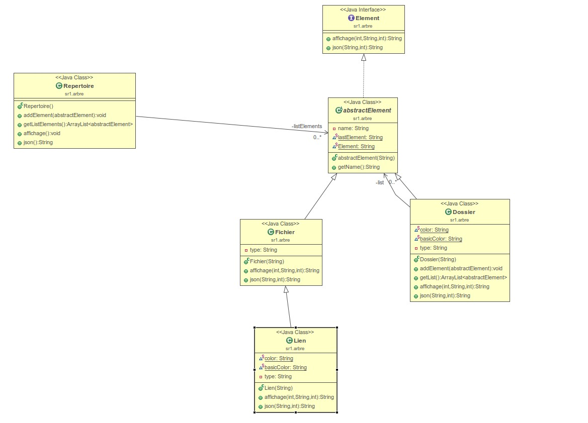
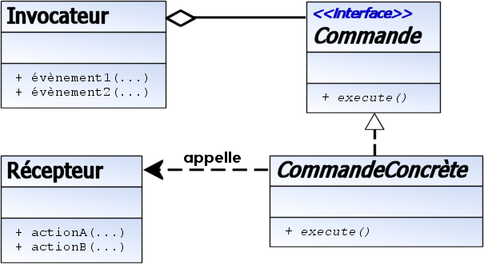
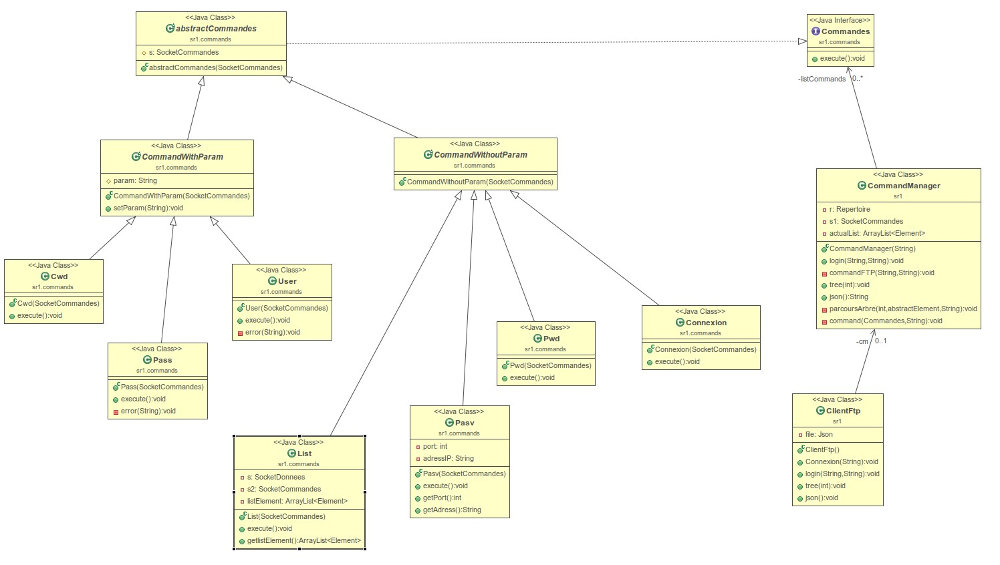
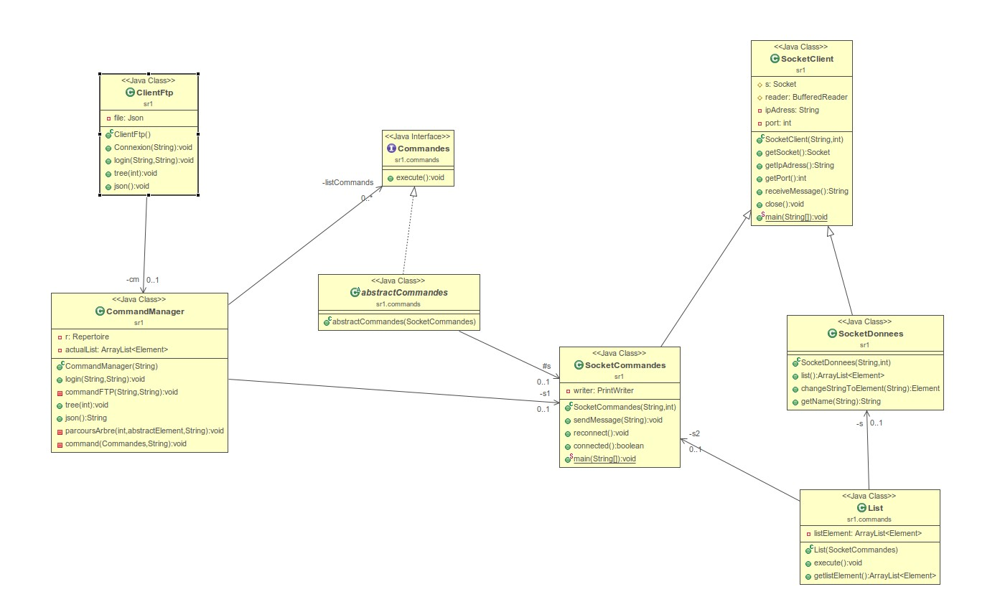

# Projet 1 - SR1

Shell command connnect with FTP server. This command print the tree of files and directories in the FTP server with a deep number of repertory.

# 🛠 Skills
Java, FTP server, FTP protocol ...

# Technologies and versions (works) 

| Library | version |
| --- | --- |
| Apache Maven | 3.9.6 |
| Java | 22 |

# Get project

After git clone the project,
following commands are executed in repertory SR1-PJT1

## Maven commands

Toutes les commandes sont à exécuter dans la racine du projet contenant pom.xml et src:

- mvn package : permettant toute la compilation du projet

- mvn clean : permettant de nettoyer le depot git

- mvn javadoc:javadoc

- java -jar target/TreeFtp-1.0.jar *adresse serveur*

server test:
- ftp.free.fr
- ftp.ubuntu.com

# Architecture 

*paquet arbre*

**Repertoire** :
Classe qui possède un attribut ArrayList d'abstractElement. Cette liste peut posséder tous les types d'éléments.

**Element** : 
Interface qui contient deux méthodes:
- affichage() : permettant l'affichage dans la console de l'élément  
- json() : permettant l'affichage dans un fichier json

**abstractElement** :
Classe abstraite qui hérite de l'interface Element,
contient un attribut name permettant le nommage des elements.

**Fichier** :
Classe qui hérite de la classe abstractElement. Cette classe permet de représenter les fichiers dans un répertoire.

**Dossier** :
Classe qui hérite de la classe abstractElement. Possède un attribut ArrayList d'abstractElement. Cette liste peut posséder tous les types d'éléments.

*paquet commands* :

**Commandes**
Interface qui contient une méthode execute()

**abstractCommandes**
Classe qui hérite de la classe Commandes. Contient un attribut SocketCommandes.

**User**, **Pass**, **Connexion**, **Cwd**, **List**, **Pasv**
Ce sont les classes qui correspondent aux commandes FTP

*paquet fichier*

**Json**
Classe qui permet d'écrire dans un fichier json.
Possède un attribut name pour l'ouverture du fichier.
Comporte la fonction write() permettant l'écriture dans le fichier.

*paquet principal*

**SocketClient**
Classe qui permet de créer une socket, le reader et le writer associé à la socket

**SocketDonnees**
Classe qui permet de récupérer toutes les données lorsque l'on effectue la commande LIST.

**MainPrinc**
Classe qui correspond au programme final. C'est cette classe qui est lancé dans le programme principal

**CommandManager**
Classe qui regroupe toutes les classes qui héritent de Commandes.
C'est ici que l'on effectue toutes les commandes réseaux.

# Diagrammes UML

*Les diagrammes ont été réalisés grace au plugin Eclipse ObjectAid UML Diagram*

Ce diagramme montre comment se compose la structure globale du répertoire et de tous les éléments qui le compose.
-----

Ce diagramme montre comment se compose la structure des commandes réseaux effectuées. Ici le design pattern Commandes a été essayer.
----

l'invocateur représenté par la classe CommandManager, l'interface Commande par celle du même nom. Les commandes concrétes par toutes les commandes FTP (ex: User, Pass, List ...). Le récepteur est fusionné avec la classe Invocateur, donc la classe Récepteur et Invocateur sont la classe CommandManager.
---

https://fr.wikipedia.org/wiki/Commande_(patron_de_conception)

Ce diagramme montre les classes qui sont composés des sockets.
La socketCommandes est présente que dans le commandManager. Elle permet l'envoie des commandes au serveur FTP.
La socketDonnees est présente seulement dans la classe List car elle permet de récupérer des données qui sont envoyés que lorsque l'on envoie la requête List.
-----

